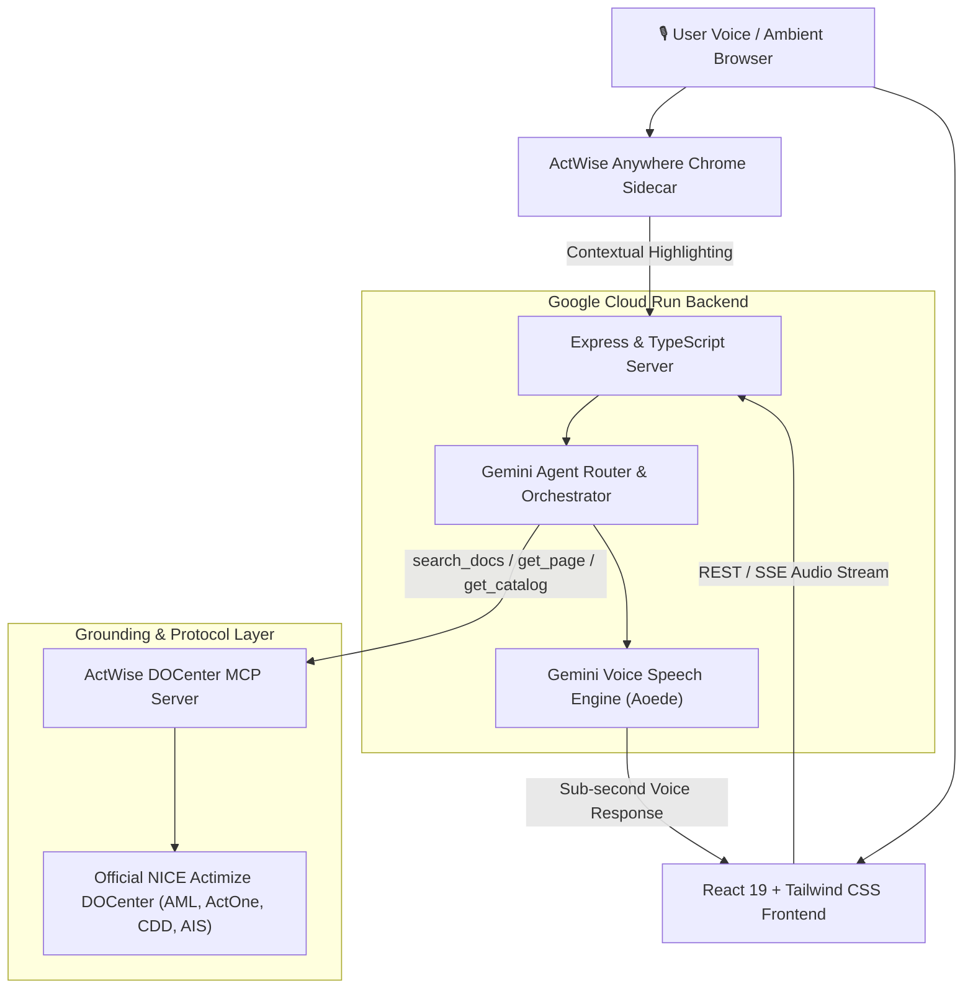

# 🏆 AI Tinkerers Global Hackathon Submission — Agents, Everywhere

> **Hackathon Portal**: [https://atlanta.aitinkerers.org/hackathons/h_pS99rSfunCc/entries](https://atlanta.aitinkerers.org/hackathons/h_pS99rSfunCc/entries)  
> **Theme**: *Agents are leaving the chatbox. Build an agent for a place people already work, talk, or live, then make it meaningfully more useful because of that context.*  
> **Target Track**: Agents, Everywhere / Google Cloud Run / CopilotKit  
> **Submission Deadline**: September 12, 2026, 4:30 PM EDT

---

## 📋 Quick Copy-Paste Fields for Portal Entry

| Field Name | Value for Form Input |
| :--- | :--- |
| **Project Name / Title** | `ActWise Live` |
| **Tagline / Short Pitch** *(<140 chars)* | `Ambient Voice Intelligence & Grounding Layer for NICE Actimize Documentation` |
| **Alternate Short Pitch** *(139 chars)* | `Ambient Voice Intelligence & Grounding Layer for NICE Actimize enterprise manuals with sub-second latency and live MCP citation grounding.` |
| **Live Production URL** | `https://actwise-live-218423701961.us-central1.run.app` |
| **GitHub Repository URL** | `https://github.com/vinayguda/ActWise-Live` |
| **Video Demo URL** | *(Upload `ActWise_Live_Demo_Submission.webm` to YouTube / Loom or paste link here)* |
| **Primary Category / Track** | `Agents, Everywhere (Voice & Ambient Enterprise Agents)` |
| **Sponsor Tracks** | `Google Cloud Run`, `CopilotKit` |
| **Team Name** | `ActWise Team` |
| **Creator / Contact** | Vinay Guda (`vguda`) |

---

## 🎯 1. Short Pitch (under 140 characters)
```text
Ambient Voice Intelligence & Grounding Layer for NICE Actimize Documentation
```
*(76 characters)*

---

## 📖 2. Detailed Description / Problem & Solution Story

### The Problem
Financial crime analysts, AML investigators, compliance officers, and platform engineers rely on mission-critical enterprise platforms like **NICE Actimize** (AML-SAM, CDD, ActOne 10.2, IFM, AIS, SURVEIL-X) to monitor billions of dollars in daily transactions. 

However, mastering and operating these platforms requires navigating **dense, fragmented 500+ page documentation manuals**, complex release matrices, and intricate deployment procedures. 
- A single missed configuration step in an ActOne 10.2 database migration or DART streaming setup can bring down real-time surveillance pipelines or cause severe compliance audit failures.
- Analysts and engineers lose hours context-switching between operational terminals, investigation screens, and monolithic PDF guides.
- Traditional LLMs either hallucinate critical configuration parameters or provide generic, ungrounded advice that cannot be trusted in high-stakes financial environments.

### The Solution: ActWise Live
**ActWise Live takes AI agents out of the static chatbox and into the live ambient workflow of enterprise compliance.** 

Instead of typing queries into isolated search boxes and reading walls of dense text, users can simply speak naturally to ActWise while performing investigations or server maintenance. ActWise provides:

1. **Sub-Second Voice Intelligence with Ambient Persona**:
   - Powered by **Google Gemini 2.0 / 3.8 Flash** with live audio synthesis.
   - Designed with an executive voice persona that speaks concise, 1-to-2 sentence spoken summaries out loud while simultaneously populating full technical procedures on screen.
   - Built-in **barge-in / interruptibility**: Users can interrupt mid-sentence to ask a follow-up or pivot to a different version without latency.

2. **Strict MCP-Grounding & Zero-Hallucination Policy**:
   - Directly integrated with the **ActWise DOCenter Model Context Protocol (MCP) server**.
   - Before answering any technical question, ActWise calls `search_docs` and `get_page` across verified Actimize DOCenter repositories.
   - **Mandatory Citation Rule**: Every technical claim, parameter name, and procedure includes verified Markdown links to the official portal documentation URL.

3. **Interactive Step-by-Step Installation Checklists**:
   - Automatically parses multi-stage procedural guides (such as the ActOne 10.2 Enterprise Installation) into reactive, interactive checklist widgets directly within the UI, allowing engineers to track their deployment progress in real time.

4. **Side-by-Side Version Comparison Matrices**:
   - Eliminates release-version confusion by rendering structured comparison tables (e.g. ActOne 10.1 vs 10.2) detailing added features (Kafka native streaming), enhanced protocols (DART SSE streaming), and deprecated interfaces (legacy SOAP gateway).

5. **"ActWise Anywhere" Ambient Chrome Extension Sidecar**:
   - A Manifest V3 extension that embeds ActWise voice intelligence directly inside internal banking dashboards, ActOne investigation consoles, and cloud environments. Users highlight any error code or configuration flag on any webpage to trigger instant voice answers.

6. **Production Cloud Run Deployment**:
   - Fully containerized and deployed globally on **Google Cloud Run** with elastic auto-scaling, high concurrency, and automated HTTPS endpoints.

---

## 🛠️ 3. Technologies Used & Architecture



- **Core AI & Multimodal Models**: Google Gemini 2.0 Flash / Gemini 3.8 Flash Multimodal Engine.
- **Protocol Standard**: Model Context Protocol (MCP) client-server architecture.
- **Frontend**: React 19, TypeScript, Tailwind CSS v4, Motion (Framer Motion), Lucide React, Canvas Audio Visualizers.
- **Backend & Streaming**: Node.js, Express, TypeScript, Server-Sent Events (SSE), safe unescaped JSON streaming parser.
- **Cloud Infrastructure**: Google Cloud Run (Containerized Microservice, zero-cold-start configuration).
- **Client Extensions**: Chrome Extension Manifest V3 (activeTab, contextual text highlighting, ambient voice trigger).

---

## 🌟 4. Hackathon Track Alignment & Sponsor Integrations

### 1. Agents, Everywhere (Grand Challenge)
- **Leaves the chatbox**: Embeds an ambient voice assistant into enterprise workflows via voice orb and a browser extension sidecar.
- **Context-Aware**: Grounds answers exclusively in enterprise documentation with interactive operational checklists and version matrices.

### 2. Google Cloud Run (Sponsor Track)
- Live Production Deployment: `https://actwise-live-218423701961.us-central1.run.app`
- Dockerized multi-stage container deployed directly to `us-central1` with automated scaling and production TLS.

### 3. CopilotKit / Agentic UI
- Agentic UI components: Reactive setup checklists, interactive comparison matrices, live MCP call inspector modal, and voice visualizer orbs.

---

## 🔗 5. Official Project URLs & Assets

- **Live Production App**: [https://actwise-live-218423701961.us-central1.run.app](https://actwise-live-218423701961.us-central1.run.app)
- **Source Code (GitHub)**: [https://github.com/vinayguda/ActWise-Live](https://github.com/vinayguda/ActWise-Live)
- **Video Demonstration**: Local recording at `recordings/ActWise_Live_Demo_Submission.webm`
- **Dual-Host Podcast Audio**: Local master at `recordings/ActWise_Podcast_Audio.wav`
- **Submission Helper Script**: `scripts/submit_to_aitinkerers.cjs`
